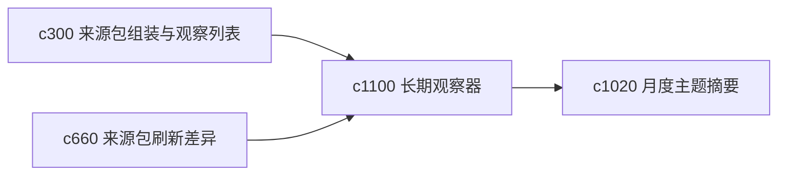

## Why

有些主题并不是一次研究，而是长期盯着变化。用户需要的不是全量重跑，而是“哪里变了、这次值不值得看”。现在已有 watchlist 和刷新差异，但还缺更稳定的长期 watcher 视角。

## What Changes

- 定义 long-running watcher，把长期观察主题的刷新策略、关注点和差异摘要收成持续对象。
- 增加 delta refresh brief，专门摘要上次以来最重要的变化。
- 支持 watcher 与来源包、问题线程和月度摘要联动。
- 保持 watcher 服务个人观察，不扩展成多用户订阅系统。

## Capabilities

### New Capabilities
- `long-running-watchers-and-delta-refresh-briefs`: 定义长期观察器和增量变化摘要。

### Modified Capabilities
- `source-pack-assembly-and-topic-watchlists`: 观察列表需要升级到长期 watcher。
- `source-pack-refresh-diff-and-brief`: 刷新差异需要能沉淀成连续 delta brief。
- `monthly-domain-briefs-and-knowledge-landmarks`: 月度摘要需要吸收 watcher 变化。

## Impact

- Backend：会影响长期观察配置、增量聚合和摘要存储。
- Frontend：会影响观察页、差异摘要和回看入口。
- Dependencies：这条线承接 `c300`、`c660`、`c1020`，是长期主题观察能力的收口。

