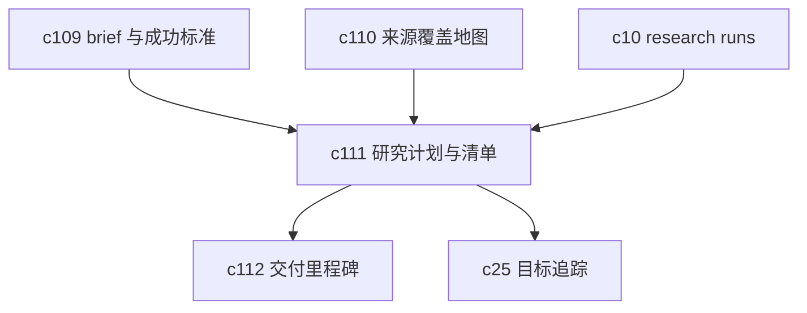

## Why

`c10` 已经把 research run 往长任务方向推了一步，但 run 能跑，不等于团队就真的会用。很多研究工作卡住，不是因为执行器不够强，而是计划写不清、阶段交付没对齐、人工检查点没留出来，最后只剩一串日志和一堆结果，过程并不好接手。

## What Changes

- 增加 research plan editor，让用户先把阶段、问题、方法、来源策略、检查点和责任人写成计划，再发起执行。
- 支持 execution checklist，把“该补什么、该确认什么、哪个阶段需要人工点头”从脑子里拿出来。
- 允许 run 在阶段之间对照计划推进，明确哪些步骤完成了，哪些是跳过的，哪些需要返工。
- 让 brief、coverage map、review 和 delivery milestone 都能引用同一份研究计划，而不是各自重新描述流程。

## Capabilities

### New Capabilities
- `research-plan-and-execution-checklists`: 定义研究计划、阶段检查点、执行清单和人工接管语义。

### Modified Capabilities
- `background-jobs-and-task-runtime`: 需要支持按计划阶段组织任务、检查点和状态同步。
- `workspace-command-registry`: 需要支持计划级动作，而不只是 run 级动作。
- `workspace-ui-panels`: 需要提供研究计划编辑、阶段视图和清单对照入口。
- `workspace-api-contract`: 需要增加计划对象、阶段状态、清单项和 run 对照接口。

## Impact

- Backend：需要新增计划模型、阶段状态机、清单项和 run 对齐逻辑。
- Frontend：需要补计划编辑器、阶段面板、清单勾选和差异提醒。
- Product：这条线不替代 `c10`，而是给 `c10` 补一层更适合团队协作和交付管理的前台语义。
- Dependencies：建议接在 `c10-agentic-research-runs`、`c109-goal-briefs-and-success-criteria-contract`、`c110-source-coverage-and-evidence-map` 之后。

## Dependency Sketch

