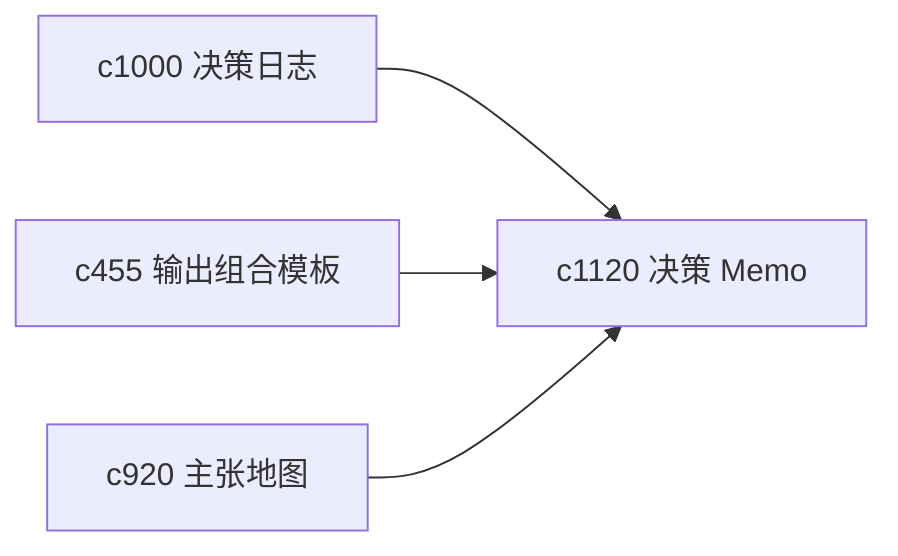

## Why

很多个人研究最后不是要写长文，而是要为一个决定留下一份能回看的 memo。它既要简明，也要能回到证据。现在这类中等重量产物还不够独立。

## What Changes

- 定义 decision memo template，把结论、备选项、判断依据和风险保留成稳定结构。
- 增加 evidence appendix，让 memo 正文保持简洁，同时保留可追溯证据附录。
- 支持 memo 与决策日志、主张地图和一页摘要互通。
- 优先服务个人回看和后续复盘，不朝外部汇报模版倾斜。

## Capabilities

### New Capabilities
- `decision-memo-templates-and-evidence-appendices`: 定义决策 memo 和证据附录结构。

### Modified Capabilities
- `decision-journals-and-why-it-changed`: 决策日志需要能输出为 memo。
- `output-composition-templates-and-layout-guards`: 模板层需要支持 memo 产物。
- `claim-map-views-and-argument-tracebacks`: 主张地图需要能服务附录回溯。

## Impact

- Backend：会影响 memo 载荷、附录绑定和模板装配。
- Frontend：会影响输出列表、memo 查看器和导出入口。
- Dependencies：这条线承接 `c1000`、`c455`、`c920`，属于个人决策沉淀层的重要产物。

