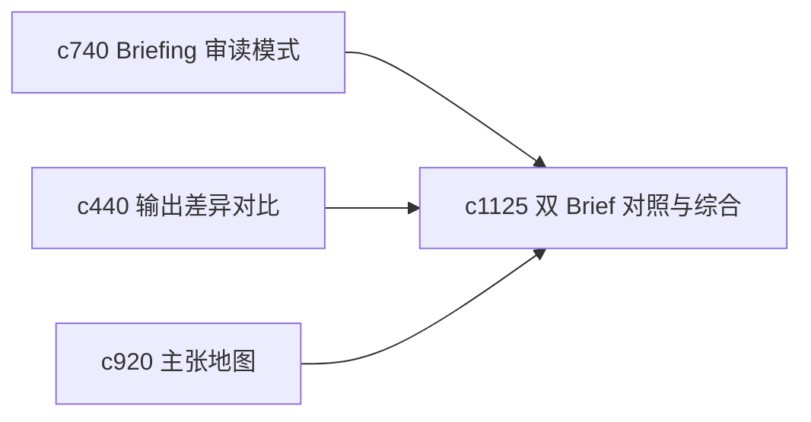

## Why

同一主题在不同时间、不同上下文下常会产出两份 briefing。真正难的是如何比较它们，再抽出一版更稳的综合稿。现在差异对比更多是版本内对比，还不够适合横向综合。

## What Changes

- 定义 compare-two-briefs，支持两份 briefing 在结构、主张和证据上的横向对照。
- 增加 synthesis merge，帮助用户从两份 briefing 生成一版综合草稿。
- 支持合并结果回接到主张地图和决策日志。
- 保持合并偏辅助，不自动吞掉细微差异。

## Capabilities

### New Capabilities
- `compare-two-briefs-and-synthesis-merge`: 定义 briefing 横向对比和综合合并。

### Modified Capabilities
- `briefing-reading-mode-and-side-by-side-evidence`: 审读模式需要支持双稿对照。
- `output-diff-compare-and-version-review`: 差异视图需要扩展到非 lineage 的双稿比较。
- `claim-map-views-and-argument-tracebacks`: 合并前后需要能回看主张变化。

## Impact

- Backend：会影响双稿比较、合并草稿和主张映射。
- Frontend：会影响 briefing 查看器、对照页和综合入口。
- Dependencies：这条线承接 `c740`、`c440`、`c920`，适合长期主题反复打磨时使用。

