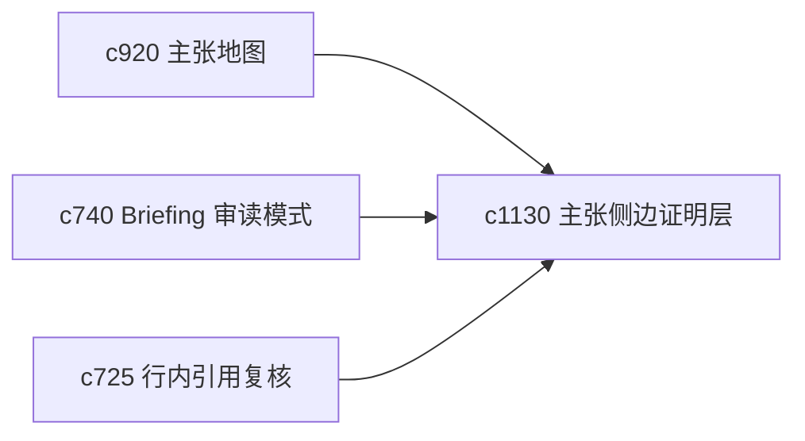

## Why

很多时候用户只想在阅读里快速确认一句话凭什么成立，而不想跳离当前上下文。需要更轻的 sidecar 证明层，让证据贴着主张出现。

## What Changes

- 定义 claim-to-source sidecar，让段落或主张旁边能弹出对应的证据证明层。
- 增加 hover proof，快速展示关键来源片段、强弱等级和冲突提示。
- 支持从 sidecar 进一步进入完整主张地图、引用队列和来源阅读器。
- 保持证明层轻量，避免把阅读界面变成信息噪音墙。

## Capabilities

### New Capabilities
- `claim-to-source-sidecars-and-hover-proofs`: 定义主张侧边证明层和悬浮证据证明。

### Modified Capabilities
- `claim-map-views-and-argument-tracebacks`: 主张地图需要产出轻量 sidecar 数据。
- `briefing-reading-mode-and-side-by-side-evidence`: 审读模式需要能直接打开 hover proof。
- `inline-citation-review-queue-and-fix-sweeps`: sidecar 需要标记存在的引用问题。

## Impact

- Backend：会影响轻量证明载荷、主张-来源映射和缓存。
- Frontend：会影响阅读器、hover 卡片和旁证侧栏。
- Dependencies：这条线承接 `c920`、`c740`、`c725`，让“为什么这样说”更低摩擦地可见。

