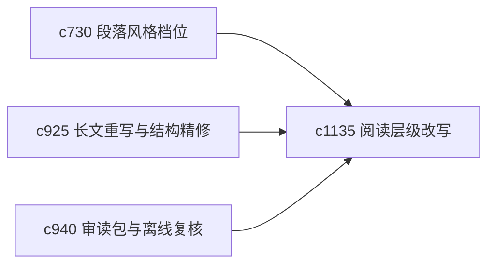

## Why

同一份内容，在不同阶段适合的阅读密度不同。用户有时要看紧凑专业版，有时要看更平直、便于快速回顾的版式。现在风格控制更偏语气，还不够覆盖阅读层级。

## What Changes

- 定义 reading level rewrite，支持把同一内容改写成不同阅读层级。
- 增加 density rewrite，控制段落紧凑度、解释展开度和信息堆叠强度。
- 支持改写保留主张与证据绑定，不让可读性提升变成事实漂移。
- 区分“阅读方便版”和“正式表达版”，避免混用。

## Capabilities

### New Capabilities
- `reading-level-and-density-rewrites`: 定义不同阅读层级和信息密度的改写。

### Modified Capabilities
- `section-style-profiles-and-tone-guards`: 风格档位需要增加阅读密度维度。
- `longform-rewrite-passes-and-structural-refinement`: 长文重写需要支持阅读层级改写。
- `reading-packets-and-offline-review-bundles`: 审读包需要能选择不同密度版本。

## Impact

- Backend：会影响改写参数、绑定保持和版本元数据。
- Frontend：会影响阅读器、导出选择和版本切换。
- Dependencies：这条线承接 `c730`、`c925`、`c940`，更偏可读性和回看效率。

