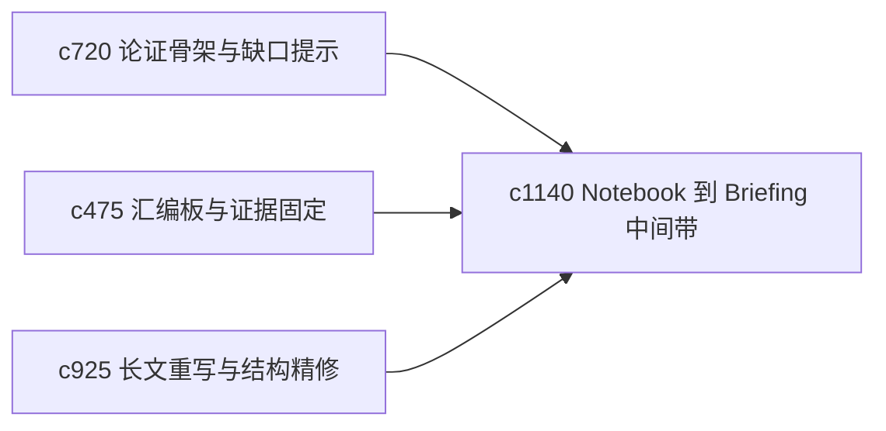

## Why

从 notebook 到 briefing 的过程里，很多内容并不是一步到位就能进成稿。需要一条中间 staging lane，把“暂时够用但还没完全定”的内容先收住。

## What Changes

- 定义 notebook-to-briefing staging lane，在笔记和 briefing 之间增加一个中间整理带。
- 支持把摘录、主张、临时段落和待核证块先放入 staging，再决定是否推进成 briefing。
- 让 staging lane 与论证骨架、引用队列和长文重写互通。
- 保持中间层简单清晰，不再复制出一套新编辑器。

## Capabilities

### New Capabilities
- `notebook-to-briefing-staging-lanes`: 定义笔记到 briefing 的中间整理带。

### Modified Capabilities
- `outline-to-argument-skeleton-and-gap-prompts`: 骨架节点需要能进入 staging。
- `briefing-assembly-board-and-evidence-pinning`: 汇编板需要能消费 staging 内容。
- `longform-rewrite-passes-and-structural-refinement`: 长文重写需要能把段落退回 staging 重新整理。

## Impact

- Backend：会影响中间对象状态、推进规则和回退路径。
- Frontend：会影响 notebook、briefing 和汇编板之间的流转。
- Dependencies：这条线承接 `c720`、`c475`、`c925`，补齐从素材到成稿的中间缓冲带。

