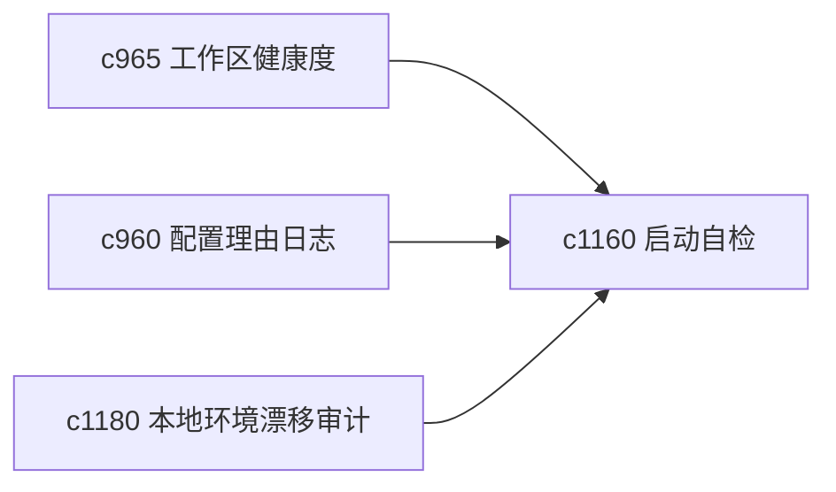

## Why

随着能力越来越多，系统“能启动”和“适合开始今天的工作”已经不是一回事。需要一套更轻的启动自检，让用户在正式进入研究前知道底盘是否稳。

## What Changes

- 定义 startup self-test，在进入工作前快速检查关键配置、关键缓存和关键契约是否在合理状态。
- 增加 operational baseline checklist，列出当前工作区最应该先确认的基础面。
- 支持自检结果回接健康度、恢复演练和环境漂移审计。
- 保持自检轻量，不变成必须每次手动跑的繁琐流程。

## Capabilities

### New Capabilities
- `operational-baseline-checklists-and-startup-self-test`: 定义启动自检和运行基线检查单。

### Modified Capabilities
- `personal-workspace-health-score-and-decay-signals`: 健康度需要吸收启动自检结果。
- `config-rationale-journal-and-safe-default-audits`: 关键配置审计需要进入自检。
- `local-environment-drift-and-dependency-audits`: 环境漂移需要成为启动自检的一部分。

## Impact

- Backend：会影响自检聚合、基线规则和诊断摘要。
- Frontend：会影响首页启动卡片、诊断页和维护入口。
- Dependencies：这条线承接 `c965`、`c960`、`c1180`，是个人工作区日常可用性的起点检查。

