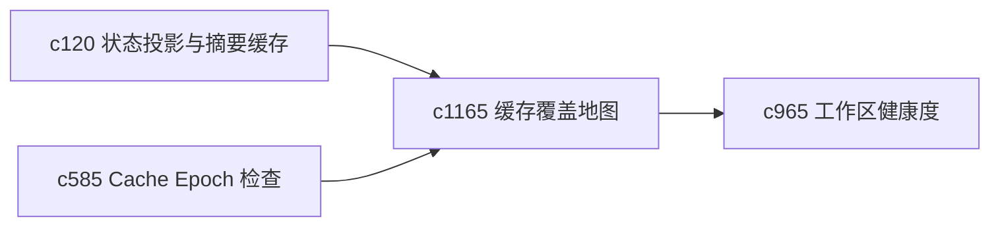

## Why

缓存不只是“有没有命中”，还包括哪些路径根本没被覆盖，哪些关键面每次都在走冷路径。没有覆盖地图，很多性能和稳定性问题会持续躲在边角。

## What Changes

- 定义 cache coverage map，把主要工作流中哪些对象和哪些查询命中缓存画出来。
- 增加 cold path detection，突出那些反复走冷路径的关键链路。
- 支持结果回接后台刷新、状态投影和健康度。
- 不追求完美性能分析，而是优先找出最影响个人使用体感的冷点。

## Capabilities

### New Capabilities
- `cache-coverage-maps-and-cold-path-detection`: 定义缓存覆盖地图和冷路径识别。

### Modified Capabilities
- `workspace-state-projection-and-summary-cache`: 摘要缓存需要暴露覆盖情况。
- `cache-epoch-inspection-and-invalidation-preview`: 失效预览需要说明哪些路径会变冷。
- `personal-workspace-health-score-and-decay-signals`: 长期冷路径需要反馈到健康分。

## Impact

- Backend：会影响缓存 telemetry、覆盖聚合和冷点分析。
- Frontend：会影响诊断台、健康度解释和性能提示。
- Dependencies：这条线承接 `c120`、`c585`、`c965`，更偏长期性能护栏。

