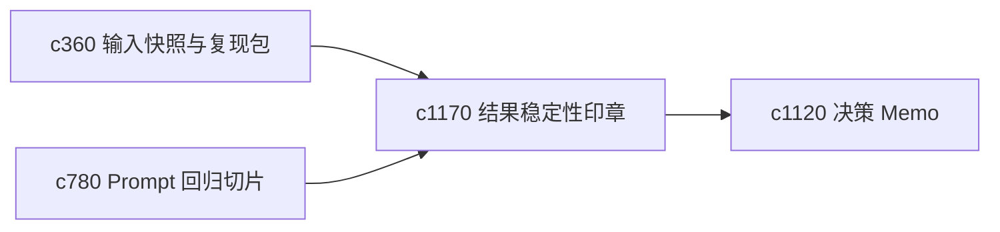

## Why

研究结果如果每次重跑都飘得很厉害，就算表面上都能生成，也很难让人放心。需要一种更轻量的“稳定性印章”，帮助判断哪些结果已经足够稳。

## What Changes

- 定义 reproducibility seal，对某次结果在给定输入条件下的稳定程度做轻量标记。
- 增加 result stability check，比较多次运行后主张、结构和证据绑定是否稳定。
- 支持稳定性结果回接 prompt 回归、决策 memo 和结果查看器。
- 避免把所有产物都追求完全一致，重点是识别“不应这么飘”的部分。

## Capabilities

### New Capabilities
- `reproducibility-seals-and-result-stability-checks`: 定义结果稳定性检查和轻量稳定印章。

### Modified Capabilities
- `run-input-snapshots-and-repro-packs`: 快照需要成为稳定性验证样本。
- `prompt-regression-slices-and-failure-fingerprints`: 回归切片需要吸收稳定性结果。
- `decision-memo-templates-and-evidence-appendices`: 重要 memo 需要能展示结果稳定度。

## Impact

- Backend：会影响稳定性比较、印章生成和结果分级。
- Frontend：会影响结果页、memo 页和诊断视图。
- Dependencies：这条线承接 `c360`、`c780`、`c1120`，把“可复现”推进到“看起来够稳”。

