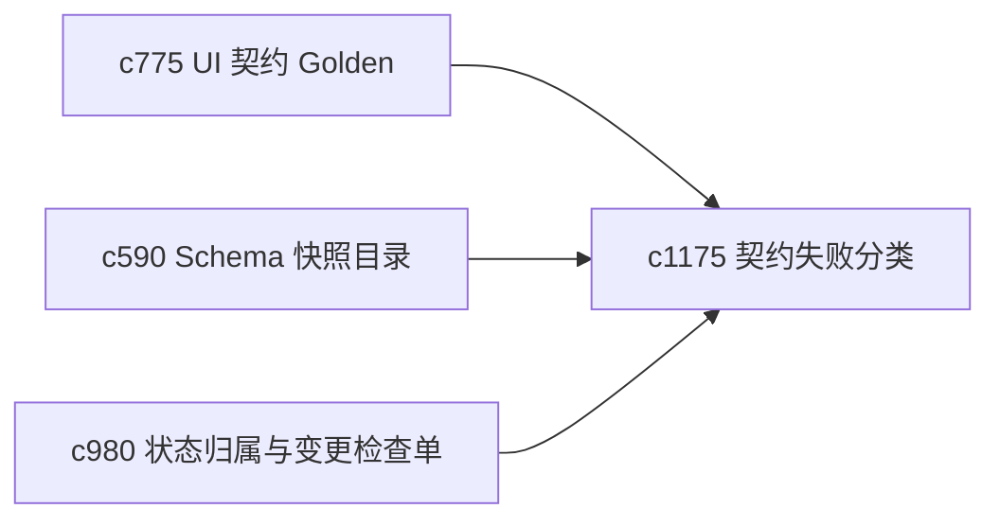

## Why

契约失败的问题一多，最怕每次都从头解释“这次到底坏在哪”。如果没有统一分类和修复剧本，重构和维护都会越来越靠记忆。

## What Changes

- 定义 contract failure taxonomy，把 API、schema、UI contract、state ownership 等失败模式统一分类。
- 增加 repair playbook，为常见失败类型给出标准排查和修复路径。
- 支持 taxonomy 与 drift alert、golden 录制、状态检查单互通。
- 保持 playbook 足够简洁，重点服务本项目持续迭代。

## Capabilities

### New Capabilities
- `contract-failure-taxonomy-and-repair-playbooks`: 定义契约失败分类和修复剧本。

### Modified Capabilities
- `ui-contract-golden-recordings-and-drift-alerts`: UI 漂移需要映射到失败分类。
- `schema-snapshot-catalog-and-regression-baselines`: Schema 回归需要进入统一 taxonomy。
- `state-schema-ownership-and-change-review-checklists`: 变更检查单需要引用修复剧本。

## Impact

- Backend：会影响失败分类、诊断输出和修复建议。
- Frontend：会影响开发诊断、回归面板和漂移说明。
- Dependencies：这条线承接 `c775`、`c590`、`c980`，是长期维护的知识压缩层。

