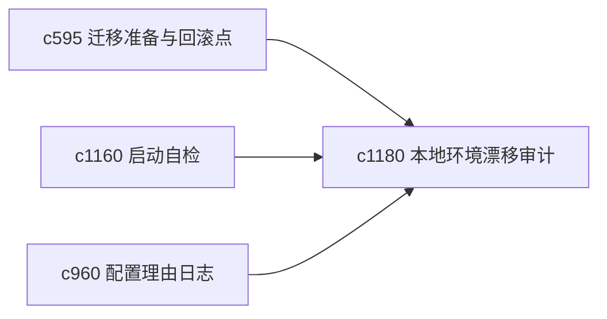

## Why

个人本地环境一旦慢慢漂移，很多问题会显得莫名其妙。尤其在长期项目里，依赖版本、工具行为和生成链路的小漂移，会直接影响稳定性和调试成本。

## What Changes

- 定义 local environment drift audit，检查关键依赖、生成工具和本地运行环境是否偏离预期。
- 增加 dependency audit，突出那些已经可能影响回放、生成或前后端契约的版本漂移。
- 支持审计结果回接启动自检、恢复演练和配置理由日志。
- 不把它做成外部依赖治理平台，重点是保障本项目本地可维护性。

## Capabilities

### New Capabilities
- `local-environment-drift-and-dependency-audits`: 定义本地环境漂移和依赖审计。

### Modified Capabilities
- `migration-readiness-report-and-rollback-checkpoints`: 迁移报告需要纳入环境漂移风险。
- `operational-baseline-checklists-and-startup-self-test`: 启动自检需要读取环境审计。
- `config-rationale-journal-and-safe-default-audits`: 配置理由需要解释关键环境依赖。

## Impact

- Backend：会影响环境快照、依赖检测和风险分级。
- Frontend：会影响诊断页、自检结果和维护建议。
- Dependencies：这条线承接 `c595`、`c1160`、`c960`，是本地长期可维护性的底层护栏。

