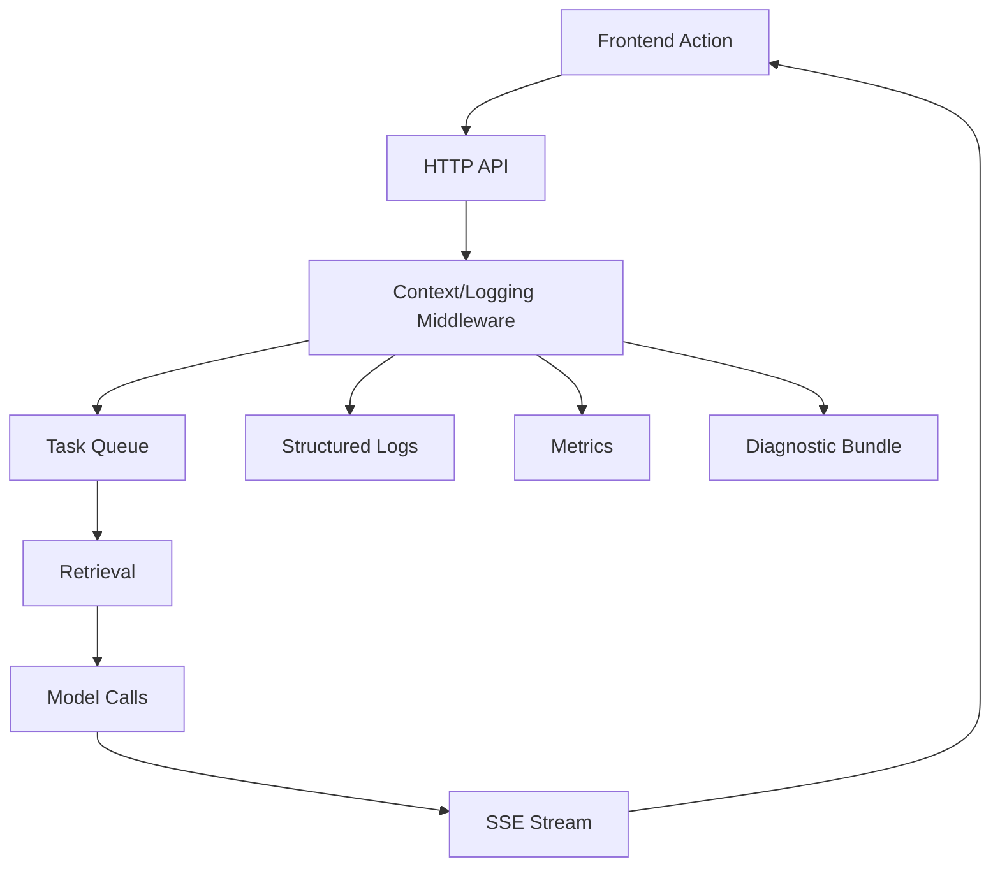

## Why

这套系统的“长链路”已经很明显：前端触发一次动作，后端会走 API → 任务队列 → 检索 → 模型调用 → SSE 回传。只要中间任何一步慢了、卡了、错了，用户看到的是“转圈”，开发看到的是“日志海”。

我们需要一个统一的可观察性包：不追求一步到位的完美监控，但至少要做到“同一次动作能串起来、能定位到哪一步、能复现到相同输入”。

## What Changes

- 统一链路标识：
  - `correlation_id`（用户动作级）
  - `trace_id/span_id`（可选，适配 OTEL/未来扩展）
  - 在 HTTP、SSE、后台任务与上游调用中强制透传
- 结构化日志收口：字段名、脱敏规则、错误采样策略统一（优先覆盖 model/retrieval/persist 这三类）。
- 最小指标集合（先求有用，再求全面）：
  - task queue 深度与等待时间
  - 检索装配耗时与 cache hit
  - 上游请求失败率与重试次数
- 引入“诊断包（diagnostic bundle）”概念：给定 `correlation_id` 能导出一份可分享、默认脱敏的排障包（为 `c30`/`c28` 打底）。
  - 前端一键导出与“把现场带走”的落点可以对齐 `c2126`，避免诊断包只停在后端接口层面。

## Capabilities

### New Capabilities

- `observability-bundle`: 链路标识、日志/指标最小集合、脱敏与诊断包导出契约。

### Modified Capabilities

- `generation-observability-and-guardrails`: 统一 error kind、采样与 timings 输出（默认关闭）。
- `delivery-and-deployment`: 在不同 profile 下的观测开关、默认值与运行成本说明。
- `workspace-api-contract`: correlation_id 在响应与 SSE 事件中的体现（让前端能复制“排障码”）。

## Impact

- Backend：middleware、logger 注入、上游调用包装会收敛；排障方式从“翻日志”变成“按 correlation 查链路”。
- Frontend：错误提示能带着 correlation_id；断线/失败可以引导到诊断台（见 `c34`/`c30`）。
- Dependencies：建议直接引用 `c2002-request-context-and-correlation-ids` 和 `c2019-structured-logging-schema-redaction-and-error-sampling`，避免重复定义。

## Dependency Sketch

