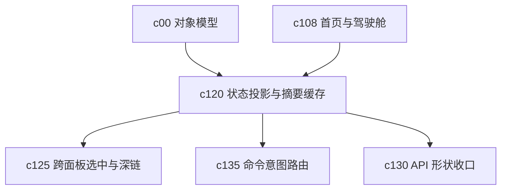

## Why

Workspace 里的状态卡片、摘要、最近上下文和推荐动作已经开始变多，但它们现在还是由不同接口和不同面板各自拼出来的。页面一复杂，这种做法很容易让同一条状态在首页、面板和弹层里说法不一致，也会把响应速度一起拖慢。

## What Changes

- 引入统一的 workspace state projection，把 notebook、source、session、task、research、output 的摘要视图收成稳定契约。
- 增加 summary cache，让首页、驾驶舱和跨面板摘要优先消费同一份投影结果，而不是各自重复聚合。
- 明确 recent context 的组成规则，区分“最近看过”“最近改过”“最近阻塞”“最近生成”这些不同语义。
- 让摘要层天然支持失效、局部刷新和轻量回放，而不是每次整页重算。

## Capabilities

### New Capabilities
- `workspace-state-projection-and-summary-cache`: 定义工作区级状态投影、摘要缓存和最近上下文装配语义。

### Modified Capabilities
- `workspace-api-contract`: 需要增加统一摘要投影、最近上下文和局部刷新接口。
- `workspace-ui-core`: 需要把首页和壳层状态展示建立在稳定投影上，而不是散落查询。
- `workspace-ui-panels`: 各面板需要消费同一份摘要对象，减少状态漂移。
- `workspace-shared-ui-state`: 需要把最近聚焦对象和摘要失效信号纳入共享状态。

## Impact

- Backend：会影响 workspace 聚合接口、状态映射、缓存失效和轻量查询路径。
- Frontend：会影响首页、顶部摘要、面板角标、最近上下文和跳转前置数据。
- Dependencies：这是 `c108-workspace-home-and-operating-cockpit` 的托底层，也会给 `c125`、`c135`、`c130` 这些后续 change 提供更稳的状态入口。

