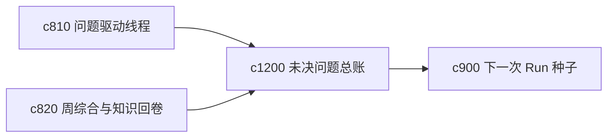

## Why

研究做久了，最容易积压的不是材料，而是那些一直悬着的问题。它们散在线程、笔记和 run 结果里，不够像一个能被主动清理、合并和关闭的账本。

## What Changes

- 定义 open questions ledger，把未决问题集中成一份可持续维护的总账。
- 增加 resolution threshold，明确什么程度算“这个问题现在可以先收口”。
- 支持 ledger 与问题线程、周综合和下一次 run 种子互通。
- 区分“已暂时足够回答”“仍缺核心证据”“不值得继续深挖”几类关闭方式。

## Capabilities

### New Capabilities
- `open-questions-ledger-and-resolution-thresholds`: 定义未决问题总账和问题收口阈值。

### Modified Capabilities
- `question-led-research-threads-and-answer-status`: 问题线程需要能进入统一总账。
- `weekly-synthesis-and-personal-knowledge-rollups`: 周综合需要能显示问题净减少情况。
- `next-run-seeding-and-carry-forward-briefs`: 续跑种子需要能从未决问题账本生成。

## Impact

- Backend：会影响问题索引、关闭状态和账本聚合。
- Frontend：会影响问题总览、继续入口和收口提示。
- Dependencies：这条线承接 `c810`、`c820`、`c900`，把问题管理从线程级推进到全局账本级。

