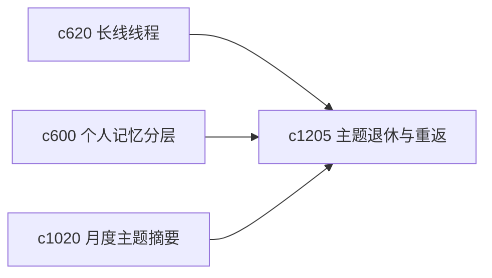

## Why

不是每个主题都该一直活跃。有些主题到了某个阶段就该冷存，有些则隔很久后还要重新捡起。现在有记忆层和长线线程，但还缺一套更明确的“退场”和“回场”路径。

## What Changes

- 定义 theme retirement，让主题可以带着阶段总结、遗留问题和恢复线索进入冷存状态。
- 增加 cold re-entry path，在重新激活时给出最短重返路径。
- 支持退休主题保留线程、地标和决策脉络，而不是简单隐藏。
- 让退场是主动整理动作，不等同于遗忘或删除。

## Capabilities

### New Capabilities
- `theme-retirement-and-cold-reentry-paths`: 定义主题退休、冷存和冷启动重返路径。

### Modified Capabilities
- `long-arc-threads-and-milestone-checkpoints`: 长线线程需要支持进入退休阶段。
- `personal-memory-layers-and-recall-views`: 记忆层需要区分活跃主题与冷存主题。
- `monthly-domain-briefs-and-knowledge-landmarks`: 月度地标需要作为主题重返入口。

## Impact

- Backend：会影响主题生命周期、冷存索引和重返摘要。
- Frontend：会影响主题列表、回看页和恢复入口。
- Dependencies：这条线承接 `c620`、`c600`、`c1020`，更适合长期使用中主题自然沉降。

