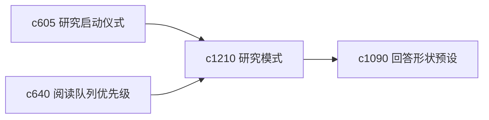

## Why

同一个人做研究时，其实常在几种完全不同的心智模式之间切换：摸底、核证、综合。如果系统始终用一种工作面接住所有阶段，很多提示都会显得不合时宜。

## What Changes

- 定义 research mode，把 explore、verify、synthesize 三种模式收成明确档位。
- 让不同模式影响阅读排序、提示强度、run 默认值和输出落点。
- 支持模式切换可见，不再让行为变化显得像黑盒。
- 保持模式数量克制，重点服务当前主线，而不是做复杂流程编排器。

## Capabilities

### New Capabilities
- `research-modes-explore-verify-synthesize`: 定义研究阶段模式和模式驱动默认行为。

### Modified Capabilities
- `research-ritual-presets-and-startup-checklists`: 启动仪式需要能按研究模式生成。
- `reading-queue-prioritization-and-guided-order`: 阅读顺序需要受当前模式影响。
- `answer-shape-presets-and-output-landing-zones`: 不同模式需要有不同结果落点偏好。

## Impact

- Backend：会影响模式状态、默认策略和建议生成。
- Frontend：会影响首页切换、运行配置和工作面文案。
- Dependencies：这条线承接 `c605`、`c640`、`c1090`，属于个人研究流程感的进一步收口。

