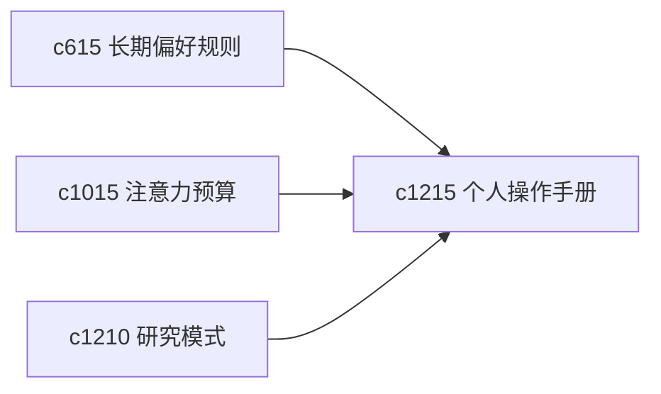

## Why

长期使用后，系统其实已经能观察到一个人的工作习惯：什么时候喜欢先读、什么时候更偏先写、什么类型的 run 总是被你打断。把这些经验沉淀成“个人操作手册”，会比零散偏好更有用。

## What Changes

- 定义 personal operating manual，把长期偏好、常用节奏和典型工作习惯收成一份工作说明。
- 增加 workstyle reflection，定期回看哪些方式更适合当前自己。
- 支持这份手册回接 attention budget、research mode 和 durable rule。
- 保持语气友好、偏建议，不变成约束性的绩效面板。

## Capabilities

### New Capabilities
- `personal-operating-manual-and-workstyle-reflection`: 定义个人工作说明和节奏反思面。

### Modified Capabilities
- `steering-preferences-and-durable-user-rules`: 长期规则需要能上升到工作方式说明。
- `attention-budget-plans-and-deep-work-windows`: 注意力计划需要引用实际工作习惯。
- `research-modes-explore-verify-synthesize`: 研究模式需要能结合个人常用模式统计。

## Impact

- Backend：会影响行为摘要、长期偏好整理和反思提示生成。
- Frontend：会影响设置页、回顾页和模式建议解释。
- Dependencies：这条线承接 `c615`、`c1015`、`c1210`，更偏个人化使用深度。

