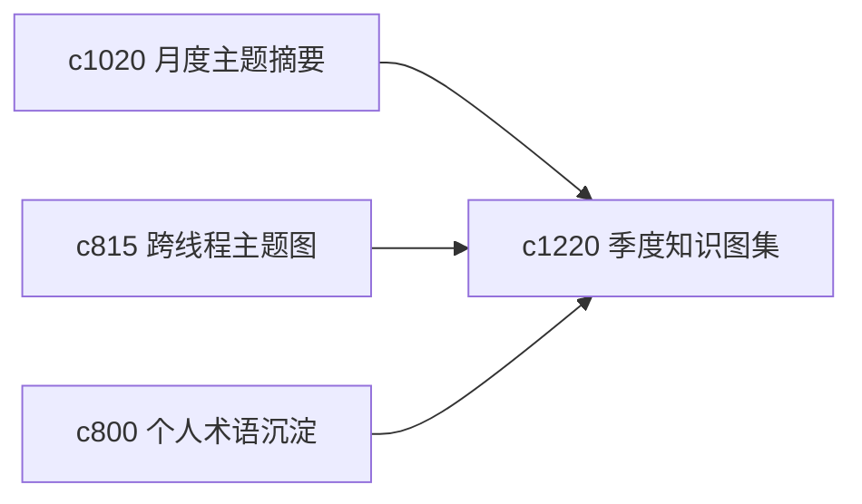

## Why

月度摘要能看见最近的变化，但更大一点的主题演化，常常要到季度尺度才会显出轮廓。需要一个更高层的 atlas，帮助用户看到领域重心是怎么挪动的。

## What Changes

- 定义 quarterly knowledge atlas，把几个主题域在更长时间里的重心变化收成一张知识地图。
- 增加 domain shift，标出哪些概念升温、哪些问题退潮、哪些判断发生结构性转向。
- 支持 atlas 与主题退休、月度摘要和术语沉淀互通。
- 保持 atlas 偏回顾与导航，不去做夸张的大图谱系统。

## Capabilities

### New Capabilities
- `quarterly-knowledge-atlas-and-domain-shifts`: 定义季度知识图集和领域重心偏移。

### Modified Capabilities
- `monthly-domain-briefs-and-knowledge-landmarks`: 月度摘要需要能汇聚成季度 atlas。
- `cross-thread-theme-maps-and-subtopic-lattices`: 主题图需要在季度层可回看。
- `personal-glossary-growth-and-term-settling`: 术语沉淀需要能进入领域重心变化。

## Impact

- Backend：会影响长期聚合、主题变化检测和 atlas 索引。
- Frontend：会影响长期回顾页、领域总览和知识地图。
- Dependencies：这条线承接 `c1020`、`c815`、`c800`，属于长期认知资产视角。

