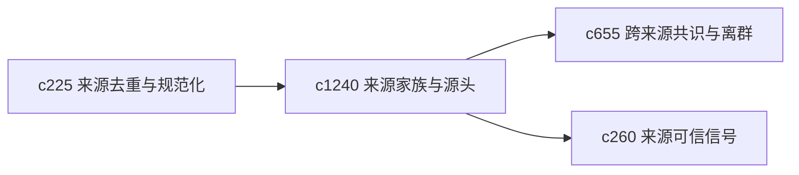

## Why

很多来源不是彼此独立的，而是同一原始材料被不同转载、摘要、改写后扩散出来。如果看不见来源家族和原点 lineage，用户很容易把重复声音误当成多方印证。

## What Changes

- 定义 source family grouping，把具有共同来源 lineage 的材料归为同一家族。
- 增加 origin lineage，尽量追出更靠前的源头与传播链。
- 支持家族视角影响可信度、阅读排序和主张权重。
- 区分“独立来源”与“同源转述”，避免假共识。

## Capabilities

### New Capabilities
- `source-family-grouping-and-origin-lineage`: 定义来源家族分组和源头 lineage。

### Modified Capabilities
- `source-deduplication-and-canonicalization-pipeline`: 去重规范化需要升级到家族层。
- `consensus-outlier-detection-across-sources`: 共识识别需要剔除同源幻觉。
- `source-trust-signals-and-quality-hints`: 可信信号需要展示来源家族关系。

## Impact

- Backend：会影响来源归并、传播链追踪和权重计算。
- Frontend：会影响来源详情、共识视图和阅读面板。
- Dependencies：这条线承接 `c225`、`c655`、`c260`，是来源可信度的重要补强。

