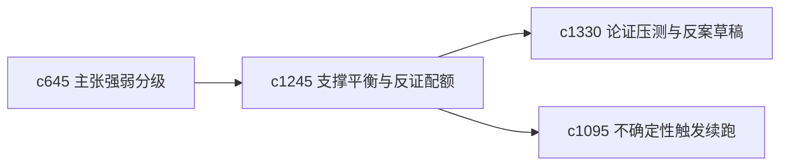

## Why

个人研究里，一个常见风险是越写越偏向支持自己当前判断，而没有主动保留足够的反例压力。需要一种更明确的“支撑与反证平衡”视角，防止论证越来越单边。

## What Changes

- 定义 claim support balance，统计每条主张当前主要靠哪类支撑站住。
- 增加 counterevidence quota，提示某些主张是否仍缺足够的反向证据审视。
- 支持平衡视角影响 pressure test、主张强弱和 follow-up run 建议。
- 不要求机械对称，只强调重要主张需要有基本反证压力。

## Capabilities

### New Capabilities
- `claim-support-balance-and-counterevidence-quotas`: 定义主张支撑平衡和反证配额。

### Modified Capabilities
- `claim-strength-grading-and-evidence-weight`: 强弱分级需要考虑是否有反向证据压力。
- `argument-pressure-tests-and-countercase-drafts`: 压测需要从配额不足处优先生成。
- `uncertainty-triggered-follow-up-runs`: 续跑建议需要优先补平衡不足的主张。

## Impact

- Backend：会影响主张分析、反证统计和优先级建议。
- Frontend：会影响主张详情、风险提示和后续建议。
- Dependencies：这条线承接 `c645`、`c1330`、`c1095`，让论证更不容易单边倾斜。

