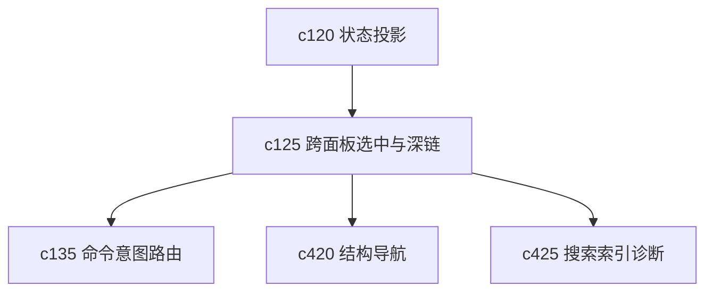

## Why

Workspace 现在已经是多面板结构了，但“我在一个面板里点中的对象，能不能稳定带到另一个面板里继续看”这件事还不够稳。很多跳转能做，但上下文会丢，深链也不够清楚。

## What Changes

- 定义跨面板 selection contract，统一 notebook、source、session、output、block、citation 的选中语义。
- 定义 deep link contract，让 URL、命令动作和面板跳转都能落到同一组对象定位规则上。
- 明确面板切换时哪些上下文应该保留，哪些需要显式重置，避免隐性状态互相污染。
- 支持“从摘要卡片直达具体对象”“从搜索直达块级位置”“从消息卡片回到来源锚点”这类高频跨面板路径。

## Capabilities

### New Capabilities
- `cross-panel-selection-and-deep-link-contract`: 定义跨面板选中、对象定位和深链跳转语义。

### Modified Capabilities
- `workspace-shared-ui-state`: 需要把选中对象和导航来源变成正式共享状态。
- `workspace-ui-core`: 需要统一 URL、面板焦点和当前上下文装配。
- `workspace-ui-panels`: 各面板需要遵守同一套入参与跳转规则。
- `workspace-command-registry`: 命令动作需要能直接落到深链目标。

## Impact

- Frontend：会影响路由、面板切换、深链解析、弹层回链和多处局部状态。
- Backend/API：影响不大，但对象定位可能需要更稳定的标识字段。
- Dependencies：这条线会接在 `c120` 后面，给 `c135` 命令组合、`c420` 结构导航和 `c425` 搜索跳转打底。

