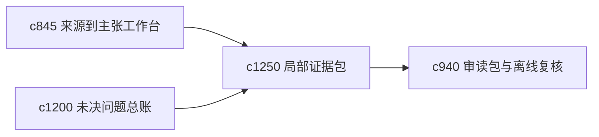

## Why

很多时候用户想处理的不是整个主题，而是某个子问题或某条主张。需要一种更小、更可携带的 evidence packet，把局部问题所需证据收成一包。

## What Changes

- 定义 evidence packet，为子问题或单条主张组装最相关的来源、摘录和反证。
- 支持 packet 直接进入审读、续跑、memo 或主张地图。
- 让 packet 带上不确定性和弱链路，而不是只打包支持材料。
- 保持 packet 小而聚焦，适合局部判断与快速重返。

## Capabilities

### New Capabilities
- `evidence-packets-for-subquestions-and-claims`: 定义面向子问题和主张的证据包。

### Modified Capabilities
- `source-to-claim-extraction-workbench`: 已确认主张需要能直接组装 packet。
- `open-questions-ledger-and-resolution-thresholds`: 未决问题需要能生成专属 packet。
- `reading-packets-and-offline-review-bundles`: 审读包需要支持嵌入局部 evidence packet。

## Impact

- Backend：会影响局部组装、证据包缓存和问题映射。
- Frontend：会影响问题详情、主张页和审读入口。
- Dependencies：这条线承接 `c845`、`c1200`、`c940`，更适合局部高效推进。

