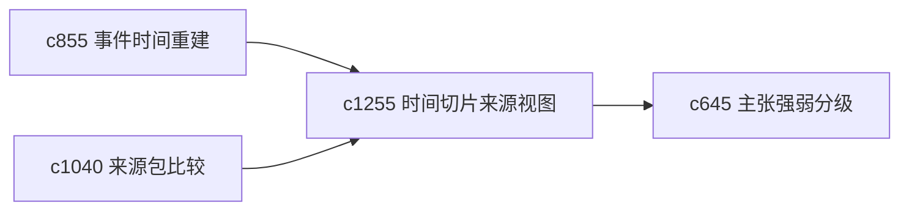

## Why

很多主题里，“什么时候的材料”跟“材料说了什么”同样重要。如果没有更清楚的时间切片视角，用户会很难判断结论是近期有效，还是被旧材料拖住了。

## What Changes

- 定义 time-sliced source view，按时间窗口查看来源集合和证据变化。
- 增加 recency lens，让用户快速切到更近、均衡或历史回看视角。
- 支持时间切片影响来源包比较、时间线重建和主张强弱。
- 避免把时间筛选做成单纯过滤器，而是强调不同时间视角下的判断差异。

## Capabilities

### New Capabilities
- `time-sliced-source-views-and-recency-lenses`: 定义时间切片来源视图和时效镜头。

### Modified Capabilities
- `source-timeline-reconstruction-and-event-ordering`: 时间重建需要引用切片视角。
- `source-bundle-comparisons-and-readiness-rankings`: 来源包比较需要支持不同时间镜头。
- `claim-strength-grading-and-evidence-weight`: 证据强弱需要受时效镜头影响。

## Impact

- Backend：会影响时间切片索引、时效聚合和镜头配置。
- Frontend：会影响来源列表、比较页和时间线页。
- Dependencies：这条线承接 `c855`、`c1040`、`c645`，更适合需要分时段判断的主题。

