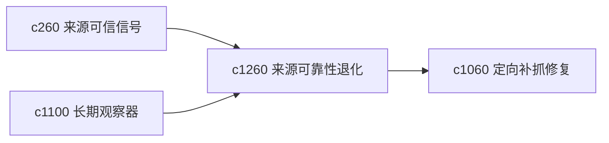

## Why

来源可靠性不是一成不变的。有些站点会慢慢变差，有些来源之前好用后来开始缺页、降质、转载泛滥。需要一个“可靠性退化”的长期观察面。

## What Changes

- 定义 source reliability regression，检测来源在一段时间内质量和可信信号是否持续变差。
- 增加 watch flag，对需要谨慎继续依赖的来源打上持续观察标记。
- 支持退化信号回接来源包、阅读排序和定向补抓。
- 区分偶发问题和趋势性退化，避免误报。

## Capabilities

### New Capabilities
- `source-reliability-regressions-and-watch-flags`: 定义来源可靠性退化和观察标记。

### Modified Capabilities
- `source-trust-signals-and-quality-hints`: 可信信号需要加入时间趋势面。
- `long-running-watchers-and-delta-refresh-briefs`: 长期观察器需要吸收来源退化信息。
- `targeted-recapture-for-broken-or-thin-sources`: 退化来源需要优先进入修复或替代路径。

## Impact

- Backend：会影响质量趋势分析、观察标记和告警摘要。
- Frontend：会影响来源详情、观察页和修复建议。
- Dependencies：这条线承接 `c260`、`c1100`、`c1060`，属于来源长期维护层。

