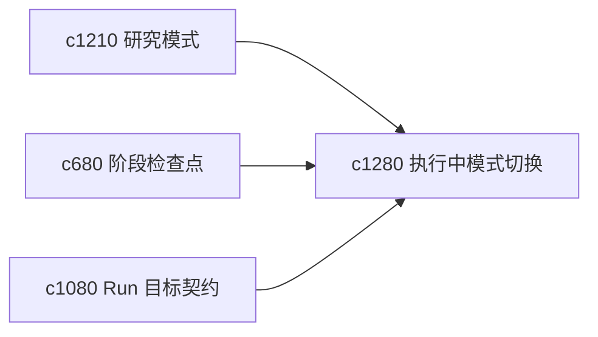

## Why

有些 run 跑到一半时，用户才发现当前目标太大、模式不对，或者其实应该转成核证而不是继续综合。现在这种转向往往只能中断重来，太浪费上下文。

## What Changes

- 定义 midflight mode switching，让 run 在关键阶段能安全切换工作模式。
- 增加 safe retargeting，把已有上下文和阶段产物尽量复用到新目标上。
- 支持转向时明确展示会保留什么、放弃什么、重算什么。
- 仍然保守处理高风险切换，避免造成更隐蔽的状态混乱。

## Capabilities

### New Capabilities
- `run-mode-switching-midflight-and-safe-retargeting`: 定义执行中模式切换和安全转向。

### Modified Capabilities
- `research-modes-explore-verify-synthesize`: 研究模式需要支持执行中切换。
- `run-stage-checkpoints-and-approval-gates`: 阶段门需要成为切换点。
- `run-goal-contracts-and-success-checks`: 目标契约需要支持安全改写。

## Impact

- Backend：会影响执行编排、阶段状态迁移和上下文复用。
- Frontend：会影响 run 面板、切换说明和结果预览。
- Dependencies：这条线承接 `c1210`、`c680`、`c1080`，让执行过程更有弹性。

