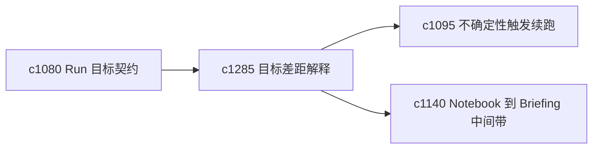

## Why

用户最不满意的结果往往不是失败，而是“看起来成功了，但其实没解决问题”。需要一个更直白的缺口报告，说明这次到底没达到哪些标准。

## What Changes

- 定义 goal gap explanation，解释结果距离目标契约还差在哪里。
- 增加 missed criteria report，把未满足的成功条件结构化列出。
- 支持缺口报告直接生成 follow-up run 建议、证据包或 staging 任务。
- 区分“差一点就够了”和“方向本身错了”两类差距。

## Capabilities

### New Capabilities
- `goal-gap-explanations-and-missed-criteria-reports`: 定义目标差距解释和未达成条件报告。

### Modified Capabilities
- `run-goal-contracts-and-success-checks`: 成功检查需要产出具体缺口说明。
- `uncertainty-triggered-follow-up-runs`: 缺口报告需要能触发更窄的续跑。
- `notebook-to-briefing-staging-lanes`: 结果不够成熟时需要能退回 staging。

## Impact

- Backend：会影响目标校验、差距分类和后续动作建议。
- Frontend：会影响 run 结束页、失败解释和继续入口。
- Dependencies：这条线承接 `c1080`、`c1095`、`c1140`，让“没做好”变成可处理的信息。

