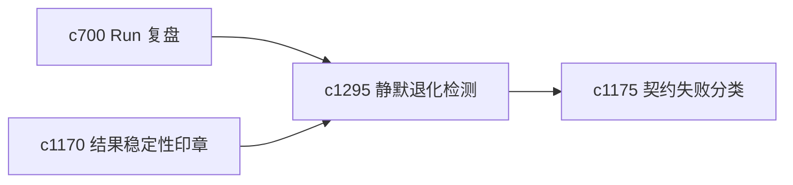

## Why

最难发现的往往不是显眼报错，而是 quietly 变差的情况：结果还能出，但引用变松了、缓存没起作用了、某个步骤总在降级。需要专门盯这种静默退化。

## What Changes

- 定义 quiet failure detection，捕捉没有显式报错但质量或路径明显变差的执行。
- 增加 silent degradation alert，对长期悄悄退化的链路做轻提醒。
- 支持退化信号回接健康度、稳定性印章和契约失败分类。
- 优先关注对真实工作感受影响大的静默问题，而不是追求全量监控。

## Capabilities

### New Capabilities
- `quiet-failure-detection-and-silent-degradation-alerts`: 定义静默失败检测和退化提醒。

### Modified Capabilities
- `run-postmortem-summaries-and-recommendation-loops`: 复盘需要识别静默退化。
- `reproducibility-seals-and-result-stability-checks`: 稳定性印章需要吸收静默失败信号。
- `contract-failure-taxonomy-and-repair-playbooks`: 静默退化需要映射到失败分类。

## Impact

- Backend：会影响退化指标、异常检测和告警摘要。
- Frontend：会影响诊断台、结果页和维护提示。
- Dependencies：这条线承接 `c700`、`c1170`、`c1175`，更偏长期质量守望。

