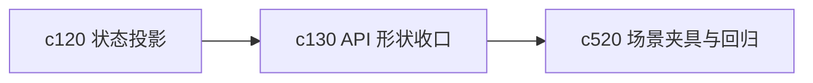

## Why

前端现在已经有不少 hook、面板和生成客户端代码，继续长下去以后，最容易先变脆的不是业务逻辑，而是 API 形状本身。只要接口返回结构不够收口，前端就会越来越多地写适配层和重复解析。

## What Changes

- 收口 workspace 相关接口的返回形状，减少同类对象在不同 endpoint 下字段名字和层级不一致的问题。
- 明确“摘要对象”“详情对象”“列表项对象”“操作结果对象”的边界，让生成客户端更薄。
- 清理前端为了适配旧返回结构而做的大量局部转换，减少 hook 和 reducer 里的形状拼接。
- 为后续 OpenAPI 生成客户端补更稳定的演进规则，降低前端 API 漂移成本。

## Capabilities

### New Capabilities
- `api-shape-consolidation-and-generated-client-slimming`: 定义 API 形状收口、对象层级约定和生成客户端瘦身边界。

### Modified Capabilities
- `workspace-api-contract`: 需要收口对象形状、列表返回和操作结果契约。
- `openapi-and-client-generation`: 需要支持更轻的客户端形状和更少的前端适配胶水层。
- `architecture-core`: 需要明确 API 形状分层和契约边界。

## Impact

- Backend：会影响 schema、endpoint 返回对象、OpenAPI 生成结果和兼容策略。
- Frontend：会影响 generated client、workspace hooks、state store 和多处对象适配代码。
- Dependencies：这条线和 `c120` 是一对，一个整理状态投影，一个整理 API 形状。它也会给 `c520` 的场景夹具带来更稳定的输入面。

