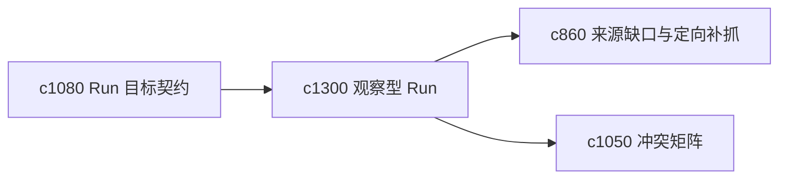

## Why

并不是每次执行都为了产出文字。有时用户只是想先探测一下：这组来源是否够用、这条问题线的证据分布怎样、冲突点集中在哪里。需要非写作型 probe run。

## What Changes

- 定义 observation run，把执行目标限定为观察、探测和形成结构信号，而不是直接写作。
- 增加 non-writing probe，支持快速产出覆盖、冲突、薄弱环和时效分布等观察结果。
- 让 observation run 可以自然转成后续写作或核证 run。
- 保持这类 run 轻量、低成本、解释性强。

## Capabilities

### New Capabilities
- `observation-runs-and-non-writing-probes`: 定义观察型执行和非写作探测。

### Modified Capabilities
- `run-goal-contracts-and-success-checks`: 目标契约需要支持非写作目标。
- `source-coverage-holes-and-targeted-fetch-suggestions`: 观察 run 需要直接产出覆盖缺口。
- `source-claim-conflict-matrix-and-resolution-lanes`: 观察 run 需要能把冲突矩阵当结果落点。

## Impact

- Backend：会影响轻量执行路径、探测结果装配和结果分类。
- Frontend：会影响 run 配置、结果页和下一步建议。
- Dependencies：这条线承接 `c1080`、`c860`、`c1050`，让执行不再默认绑定写作。

