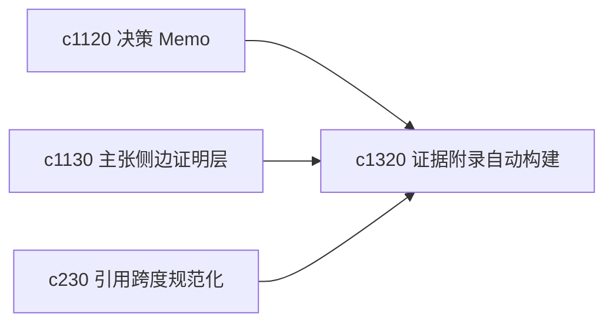

## Why

很多产物真正花时间的不是正文，而是把脚注、附录和可追溯证据整理好。既然前面已经有主张图和证据附录方向，就应该把附录构建尽量自动化。

## What Changes

- 定义 evidence appendix autobuild，从主张和引用链自动组装证据附录。
- 增加 traceable footnote，让脚注不仅能跳到来源，还能说明它支撑的是哪条主张。
- 支持附录和 footnote 与 memo、report、briefing 共用。
- 保留人工调整空间，避免自动附录掩盖错误绑定。

## Capabilities

### New Capabilities
- `evidence-appendix-autobuild-and-traceable-footnotes`: 定义证据附录自动构建和可追溯脚注。

### Modified Capabilities
- `decision-memo-templates-and-evidence-appendices`: memo 附录需要能自动化装配。
- `claim-to-source-sidecars-and-hover-proofs`: 证明层需要共享可追溯脚注数据。
- `citation-span-normalization-and-source-anchoring`: 锚点规范化需要服务附录和脚注构建。

## Impact

- Backend：会影响附录组装、脚注映射和引用缓存。
- Frontend：会影响输出查看器、脚注交互和附录页。
- Dependencies：这条线承接 `c1120`、`c1130`、`c230`，是可信产物层的自然深化。

