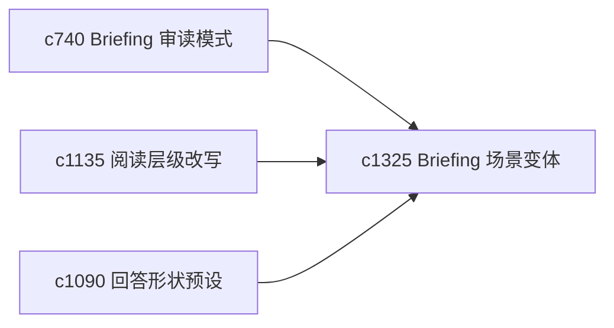

## Why

同一份 briefing，在“快速回顾”“深读核证”“下次继续”这几种场景下，需要的形态并不一样。现在更像一份通用稿，还缺按目的切出来的变体。

## What Changes

- 定义 purpose-based briefing variant，按阅读场景切出不同版式和信息密度。
- 支持 variant 复用同一主张、证据和不确定性，只改变组织方式。
- 让 variant 与阅读层级改写、审读包和结果落点协同。
- 避免做成太多模板，只覆盖真实高频场景。

## Capabilities

### New Capabilities
- `briefing-variants-by-purpose-and-reading-scenario`: 定义不同阅读场景下的 briefing 变体。

### Modified Capabilities
- `briefing-reading-mode-and-side-by-side-evidence`: 审读模式需要能切换 variant。
- `reading-level-and-density-rewrites`: 阅读层级改写需要能服务 briefing 变体。
- `answer-shape-presets-and-output-landing-zones`: 结果落点需要支持生成不同目的变体。

## Impact

- Backend：会影响 variant 装配、布局选择和元数据。
- Frontend：会影响 briefing 查看器、切换入口和导出行为。
- Dependencies：这条线承接 `c740`、`c1135`、`c1090`，更偏阅读体验精修。

