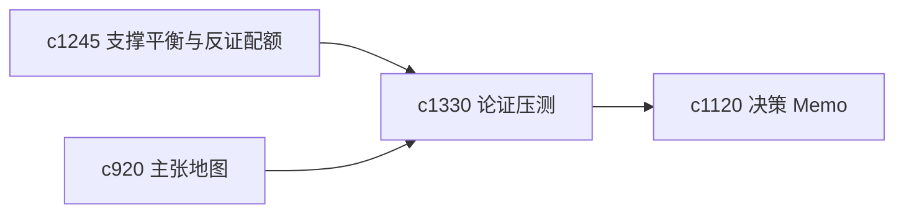

## Why

很多主张不是看它能不能说通，而是看它在压力测试下还能不能站住。系统已经能标不确定和冲突，但还缺更主动的反案草稿与压测面。

## What Changes

- 定义 argument pressure test，主动检查某条论证在反例、替代解释和证据不足下会怎样松动。
- 增加 countercase draft，生成一版有代表性的反向论证草稿供用户对照。
- 支持压测结果回接主张强弱、决策 memo 和续跑建议。
- 保持压测是审视工具，不自动替用户反转结论。

## Capabilities

### New Capabilities
- `argument-pressure-tests-and-countercase-drafts`: 定义论证压测和反案草稿。

### Modified Capabilities
- `claim-support-balance-and-counterevidence-quotas`: 支撑平衡需要成为压测入口。
- `claim-map-views-and-argument-tracebacks`: 主张地图需要显示受压最明显的节点。
- `decision-memo-templates-and-evidence-appendices`: memo 需要能附带压测摘要。

## Impact

- Backend：会影响压测逻辑、反案生成和主张标记。
- Frontend：会影响主张详情、memo 页和风险说明。
- Dependencies：这条线承接 `c1245`、`c920`、`c1120`，适合做高风险判断前的自我对冲。

