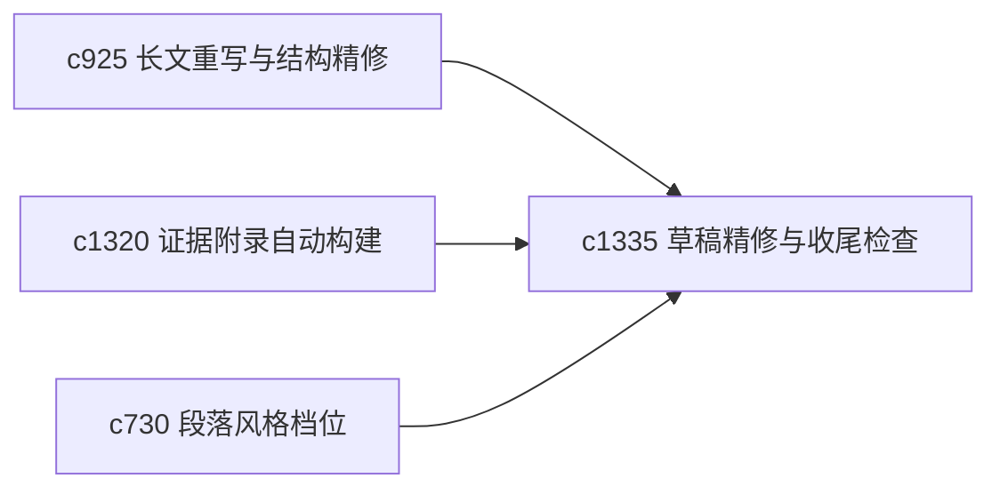

## Why

很多草稿到了最后阶段，真正需要的是一组小而确定的 finish pass，而不是再大改结构。需要一套更贴近“收尾”的整理动作。

## What Changes

- 定义 polish pass，把收尾动作拆成术语统一、重复消除、句子压实、脚注检查等几类小 pass。
- 增加 finish check，明确哪些收尾面已经过了一遍，哪些还没扫到。
- 支持 finish pass 与阅读层级改写、附录自动构建和长文重写协同。
- 让 finish check 更像临门一脚清单，而不是新的重流程。

## Capabilities

### New Capabilities
- `draft-polish-passes-and-finish-checks`: 定义草稿精修 pass 和收尾检查。

### Modified Capabilities
- `longform-rewrite-passes-and-structural-refinement`: 长文重写需要和收尾 pass 区分阶段。
- `evidence-appendix-autobuild-and-traceable-footnotes`: 收尾检查需要包含附录与脚注面。
- `section-style-profiles-and-tone-guards`: 风格档位需要参与术语和语气统一。

## Impact

- Backend：会影响精修任务分解、收尾状态和结果标记。
- Frontend：会影响编辑器、检查单和最终预览。
- Dependencies：这条线承接 `c925`、`c1320`、`c730`，更适合成稿前最后整理。

