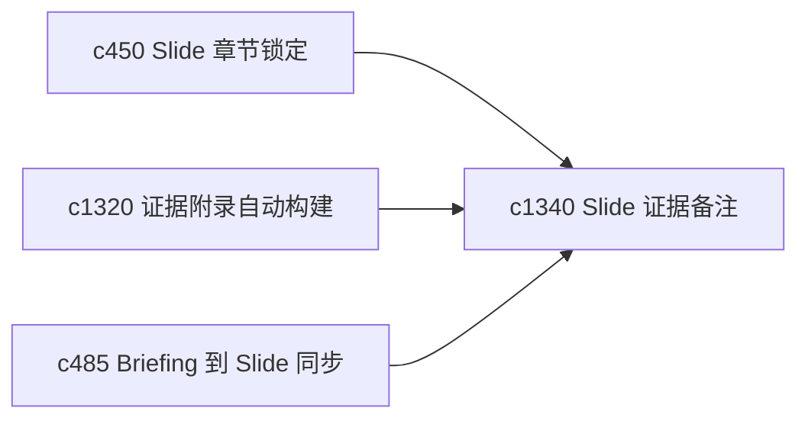

## Why

当输出变成 slide 时，真正容易丢的是“这一页到底凭什么这么讲”。需要一种更贴近 slide 的证据说明层，让讲述和证据不再脱节。

## What Changes

- 定义 evidence-aware slide note，让每页 slide 都能挂接对应证据与风险提醒。
- 增加 speaker brief，帮助用户在快速回看或口头讲述前抓住这一页最重要的依据。
- 支持 slide note 复用主张地图、附录脚注和 briefing 变体。
- 保持它服务个人演示与回看，不做公开演讲平台化功能。

## Capabilities

### New Capabilities
- `evidence-aware-slide-notes-and-speaker-briefs`: 定义带证据说明的 slide note 和讲述摘要。

### Modified Capabilities
- `slides-section-locking-and-incremental-regeneration`: slide 章节锁定需要保留证据说明。
- `evidence-appendix-autobuild-and-traceable-footnotes`: 脚注与附录需要能回接 slide note。
- `briefing-to-slide-outline-sync-and-drift-hints`: briefing 与 slide 同步需要带上证据语义。

## Impact

- Backend：会影响 slide 元数据、证据绑定和摘要生成。
- Frontend：会影响 slide 查看器、讲述备注和同步提示。
- Dependencies：这条线承接 `c450`、`c1320`、`c485`，让 slide 也纳入可信输出链。

