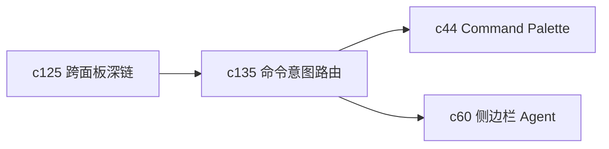

## Why

Command Palette 和快捷操作已经有基础了，但现在更像一组离散命令。用户真正想做的往往不是“执行一个按钮”，而是“把几个动作串成一个顺手的流程”。如果命令层一直停在单动作，后面的工作流就很难变得更快。

## What Changes

- 把命令从静态动作升级为 intent routing，先识别用户想做什么，再选择最合适的入口或动作组合。
- 支持 action composition，让常见的两步到三步操作可以被收成一个命令流程。
- 明确命令的前置条件、风险级别和失败回退，避免快捷入口变成另一套隐性流程。
- 让命令层直接消费 `c125` 的深链契约和 `c120` 的摘要状态，而不是自己再猜上下文。

## Capabilities

### New Capabilities
- `command-intent-routing-and-action-composition`: 定义命令意图识别、动作组合和失败回退语义。

### Modified Capabilities
- `workspace-command-registry`: 需要从动作注册扩展到意图、前置条件和组合流程。
- `workspace-ui-core`: 需要补命令预览、风险提示和组合执行反馈。
- `workspace-ui-panels`: 面板动作需要声明可被命令层消费的能力边界。

## Impact

- Frontend：会影响 Command Palette、快捷键、按钮复用和执行反馈。
- Backend/API：部分命令可能需要统一 action endpoint 或组合执行接口。
- Dependencies：这条线紧跟 `c125`，同时会给 `c44-command-palette-and-automation-shortcuts` 和 `c60-personal-agent-sidebar-and-global-hotkey` 提供更像样的中间层。

