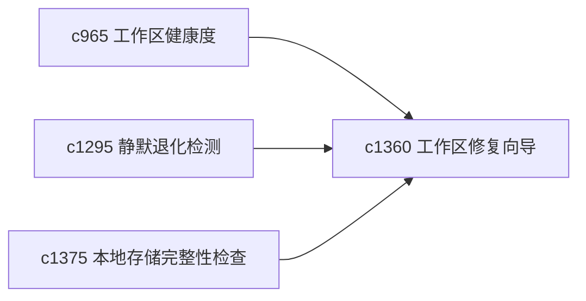

## Why

工作区一旦出现一串小问题，用户最需要的不是十个分散提示，而是一条安全的修复路径。现在诊断越来越丰富，但“怎么一次处理一批低风险问题”还不够顺。

## What Changes

- 定义 workspace repair wizard，把常见低风险问题收成可连续执行的修复向导。
- 增加 safe fix batch，允许用户对一组可回滚的小问题一起修。
- 支持修复批次与健康度、静默退化和本地存储检查协同。
- 保持 batch 修复边界清晰，避免波及高风险对象。

## Capabilities

### New Capabilities
- `workspace-repair-wizards-and-safe-fix-batches`: 定义工作区修复向导和安全批处理。

### Modified Capabilities
- `personal-workspace-health-score-and-decay-signals`: 健康问题需要能进入修复向导。
- `quiet-failure-detection-and-silent-degradation-alerts`: 静默退化需要能进入低风险修复批次。
- `local-store-integrity-checks-and-healing-suggestions`: 本地存储问题需要能挂入修复向导。

## Impact

- Backend：会影响问题聚合、修复动作编排和回滚点记录。
- Frontend：会影响诊断台、修复面板和结果确认。
- Dependencies：这条线承接 `c965`、`c1295`、`c1375`，把“发现问题”进一步推进到“安全修一批”。

