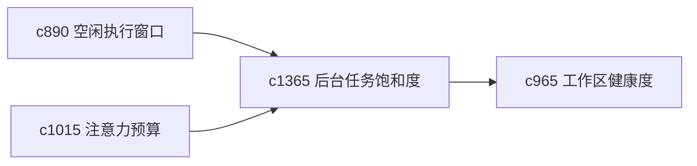

## Why

后台任务多了以后，真正烦人的往往不是某个任务本身，而是整体噪音开始堆积。需要一个更直观的饱和度地图，帮助看见哪里太吵、哪里值得收口。

## What Changes

- 定义 saturation map，把后台刷新、整理、清理和观察任务的密度可视化。
- 增加 noise pruning，帮助用户裁掉对当前阶段价值不高的后台动作。
- 支持饱和度结果回接 idle execution、attention budget 和健康度。
- 重点是减少干扰，而不是做复杂调度中心。

## Capabilities

### New Capabilities
- `background-task-saturation-maps-and-noise-pruning`: 定义后台任务饱和度和噪音修剪。

### Modified Capabilities
- `background-refresh-windows-and-idle-execution`: 空闲执行需要能展示任务密度。
- `attention-budget-plans-and-deep-work-windows`: 深度工作窗口需要能压低后台噪音。
- `personal-workspace-health-score-and-decay-signals`: 后台任务堆积需要反馈到健康分。

## Impact

- Backend：会影响任务密度统计、建议修剪和调度摘要。
- Frontend：会影响维护页、设置页和噪音提示。
- Dependencies：这条线承接 `c890`、`c1015`、`c965`，更偏长期使用的安静感优化。

