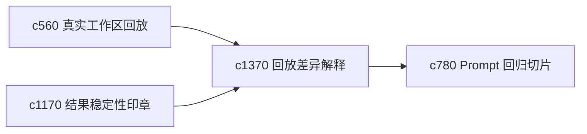

## Why

回放和基线比较越来越多以后，用户不只想知道“不同”，还想知道“这种不同是不是可以接受”。没有 exception 机制，很多有意义的小漂移也会被当成同一种噪音。

## What Changes

- 定义 replay diff explanation，对回放差异给出更具体的分类解释。
- 增加 baseline exception，允许为合理差异保留已知例外说明。
- 支持 exception 与稳定性印章、回归切片和契约失败分类联动。
- 保持例外机制谨慎，避免演变成掩盖真实问题的黑洞。

## Capabilities

### New Capabilities
- `replay-diff-explanations-and-baseline-exceptions`: 定义回放差异解释和基线例外。

### Modified Capabilities
- `real-workspace-eval-dataset-capture-and-replay`: 回放结果需要附带差异解释。
- `reproducibility-seals-and-result-stability-checks`: 稳定性判断需要支持已知例外。
- `prompt-regression-slices-and-failure-fingerprints`: 回归切片需要标注哪些差异已被例外化。

## Impact

- Backend：会影响差异分类、例外记录和回放报告。
- Frontend：会影响回放页、回归页和稳定性说明。
- Dependencies：这条线承接 `c560`、`c1170`、`c780`，让基线维护更细腻。

