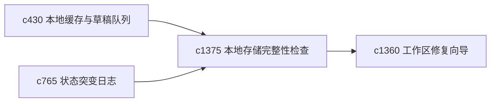

## Why

本地优先和缓存能力越强，本地数据层就越值得被认真守护。很多问题不是接口错了，而是本地 store 有局部损伤、遗留旧对象或状态互相打架。

## What Changes

- 定义 local store integrity check，检查关键本地对象、索引和草稿链路是否一致。
- 增加 healing suggestion，提供低风险修复建议。
- 支持完整性检查与本地缓存队列、状态突变日志和修复向导互通。
- 优先做可解释、可回滚的修复，不做粗暴重置。

## Capabilities

### New Capabilities
- `local-store-integrity-checks-and-healing-suggestions`: 定义本地存储完整性检查和修复建议。

### Modified Capabilities
- `local-cache-draft-queue-and-sync-preflight`: 草稿与同步链路需要接受完整性检查。
- `state-mutation-journal-and-debug-rewind`: 状态日志需要帮助定位本地损伤来源。
- `workspace-repair-wizards-and-safe-fix-batches`: 完整性问题需要进入修复向导。

## Impact

- Backend：主要影响本地数据结构验证和修复建议生成。
- Frontend：会影响诊断台、本地状态页和修复确认入口。
- Dependencies：这条线承接 `c430`、`c765`、`c1360`，是本地私有产品非常关键的一层底盘。

