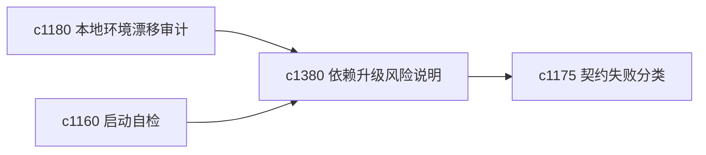

## Why

项目越往后，依赖升级越容易牵一发动全身。真正需要的不是“有没有新版本”，而是“这次升级对当前工作区主线会带来什么风险”。

## What Changes

- 定义 dependency upgrade risk note，为关键依赖变更记录潜在影响面。
- 增加 migration hint，指出升级后最该优先验证的链路。
- 支持风险说明回接环境漂移审计、启动自检和契约失败分类。
- 重点服务本项目持续演进，不做通用依赖管理平台。

## Capabilities

### New Capabilities
- `dependency-upgrade-risk-notes-and-migration-hints`: 定义依赖升级风险说明和迁移提示。

### Modified Capabilities
- `local-environment-drift-and-dependency-audits`: 环境审计需要提供升级风险上下文。
- `operational-baseline-checklists-and-startup-self-test`: 启动自检需要针对近期升级给出优先检查。
- `contract-failure-taxonomy-and-repair-playbooks`: 常见升级带来的失败模式需要进入修复剧本。

## Impact

- Backend：会影响依赖风险记录、迁移提示和版本上下文。
- Frontend：会影响诊断页、维护页和升级后提醒。
- Dependencies：这条线承接 `c1180`、`c1160`、`c1175`，是长期迭代时的低频高价值护栏。

