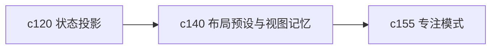

## Why

Workspace 现在已经是一个多面板工作区了。问题不是面板不够，而是每次回到现场时，布局、筛选、焦点对象和展开状态常常要重新摆一遍。用得越久，这种重复动作越烦。

## What Changes

- 定义 workspace layout preset，支持按工作方式保存布局组合，而不是只有一套当前状态。
- 增加 view memory，让当前 notebook、面板展开、筛选器和最近焦点对象能稳定回到上次现场。
- 区分全局布局偏好、workspace 级布局和一次性临时布局，避免状态互相污染。
- 支持在不同任务形态之间快速切换，例如采集视角、研究视角、整理视角和输出视角。

## Capabilities

### New Capabilities
- `workspace-layout-presets-and-view-memory`: 定义布局预设、视图记忆和工作现场恢复语义。

### Modified Capabilities
- `workspace-ui-core`: 需要承载布局预设、视图记忆和恢复入口。
- `workspace-shared-ui-state`: 需要正式表达可持久化的布局与焦点状态。
- `workspace-api-contract`: 若布局跨设备同步，需要补稳定的布局对象与读写接口。

## Impact

- Frontend：会影响 Workspace 壳层、面板布局、状态持久化和恢复逻辑。
- Backend/API：若支持云端同步，会影响布局读写和用户偏好接口。
- Dependencies：这条线承接 `c120-workspace-state-projection-and-summary-cache`，也会给 `c155` 的专注模式留出稳定落点。

