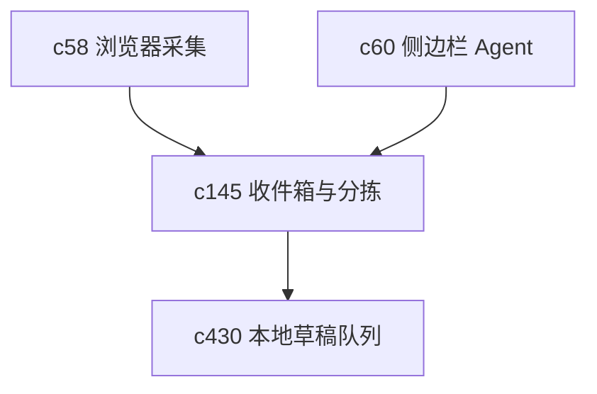

## Why

用户很多时候不是在“正式整理资料”，而是在路过时顺手记下一段话、一个链接、一个判断。现在这些轻采集入口还不够像一个统一收件箱，结果就是内容先散落，之后再补收拾。

## What Changes

- 引入 quick capture inbox，统一承接网页片段、临时笔记、待整理来源和草稿想法。
- 定义 triage flow，让用户可以把 inbox 里的内容快速归到 notebook、source、task 或稍后处理队列。
- 支持轻量标签、来源类型判断和最低限度的摘要展示，减少“先记下来还得先做一堆表单”的摩擦。
- 让 inbox 和浏览器采集、侧边栏 Agent、移动采集共享同一套落地语义。

## Capabilities

### New Capabilities
- `quick-capture-inbox-and-triage-flow`: 定义轻采集收件箱、待整理对象和快速分拣语义。

### Modified Capabilities
- `workspace-ui-core`: 需要增加 inbox 入口、分拣视图和轻量处理动作。
- `workspace-api-contract`: 需要支持 inbox item、归档动作和批量分拣接口。
- `browser-clipper-and-web-capture`: 浏览器采集需要能直接落到 inbox。
- `personal-agent-sidebar-and-global-hotkey`: 轻入口需要能把草稿安全送进 inbox。

## Impact

- Backend：会影响轻采集对象模型、分拣动作和对象映射逻辑。
- Frontend：会影响快速采集入口、收件箱列表和快捷分拣交互。
- Dependencies：这条线会和 `c430-local-cache-draft-queue-and-sync-preflight` 自然咬合，也会抬高 `c58` 这类采集入口的使用价值。

