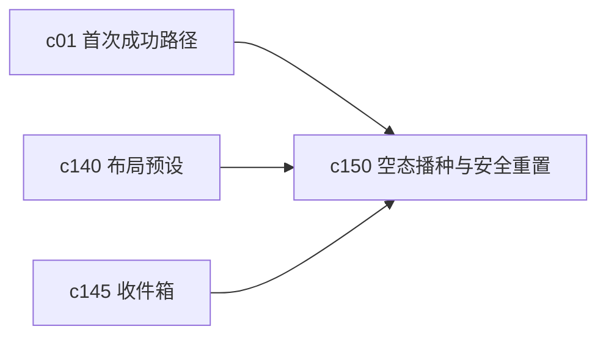

## Why

空工作区不一定难看，但很容易让人停住。尤其是当用户已经折腾过一轮、状态又有点乱时，最需要的往往不是更多说明，而是一个能重新起步、又不会把东西误删的安全重置路径。

## What Changes

- 定义 workspace seeding，支持为空工作区快速注入最小可运行骨架。
- 增加 safe reset，让用户在不破坏已有资产的前提下，清理布局、临时状态和实验痕迹。
- 支持多种播种包，例如最小研究工作区、写作工作区、来源整理工作区。
- 把 reset 和 seed 做成可预览动作，先说明会改什么，再执行。

## Capabilities

### New Capabilities
- `workspace-empty-state-seeding-and-safe-reset`: 定义空态播种、工作区最小骨架和安全重置语义。

### Modified Capabilities
- `first-run-success-path`: 首次进入需要能直接消费 seed。
- `workspace-home-and-operating-cockpit`: 首页需要区分真正空态、可恢复乱态和建议重置态。
- `workspace-api-contract`: 需要增加 seed preview、reset preview 和执行接口。

## Impact

- Backend：会影响 seed 模板、重置范围定义和预览结果装配。
- Frontend：会影响空态入口、重置向导和执行确认。
- Dependencies：这条线和 `c140`、`c145` 是一组，一个解决空态，一个解决轻采集，一个解决回到现场。

