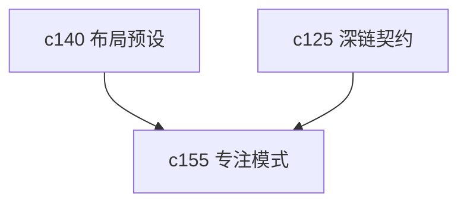

## Why

当工作区里对象、面板和通知都多起来以后，真正浪费精力的不是找不到入口，而是所有入口同时在眼前。个人工作台尤其需要一种“先只看这一件事”的模式。

## What Changes

- 定义 workspace focus mode，让用户围绕当前 notebook、当前 run、当前 output 或当前 source 临时收窄界面。
- 支持 distraction pruning，把无关卡片、角标、推荐动作和次要面板暂时降噪。
- 焦点模式退出后恢复原始布局，不把临时聚焦误写成长期偏好。
- 让 focus mode 共享 `c140` 的视图记忆和 `c125` 的深链定位。

## Capabilities

### New Capabilities
- `workspace-focus-mode-and-distraction-pruning`: 定义专注模式、界面降噪和焦点恢复语义。

### Modified Capabilities
- `workspace-ui-core`: 需要支持焦点态、收窄布局和退出恢复。
- `workspace-shared-ui-state`: 需要增加焦点对象与临时降噪状态。
- `cross-panel-selection-and-deep-link-contract`: 焦点入口需要消费统一定位规则。

## Impact

- Frontend：会影响 Workspace 布局、可见性控制和焦点入口。
- Backend/API：影响不大，主要取决于是否需要额外摘要接口。
- Dependencies：这条线建立在 `c140` 和 `c125` 之上，属于体验提纯，不是新工作流。

