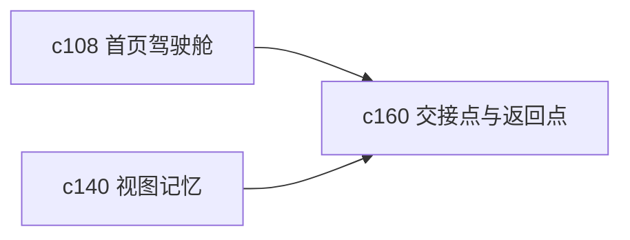

## Why

个人工作台最常见的中断不是报错，而是被打断。人离开一会儿再回来，经常只记得“刚才在做什么”，但记不住停在哪一步。没有稳定的交接点，工作台用久了还是会碎。

## What Changes

- 定义 session handoff point，把会话、研究、输出和 notebook 编辑中的“停下位置”收成正式对象。
- 支持 return point，让用户能一键回到最近一次未完成的上下文，而不是只看最近打开列表。
- 区分自动记录的返回点和用户手动钉住的返回点，避免重要节点被新活动冲掉。
- 让返回点能带上最小必要上下文，例如当前块、当前来源、当前输出草稿和下一步建议。

## Capabilities

### New Capabilities
- `session-handoff-and-return-points`: 定义工作中断点、返回点和上下文恢复语义。

### Modified Capabilities
- `workspace-home-and-operating-cockpit`: 首页需要承接返回点与未完成工作。
- `workspace-shared-ui-state`: 需要保存可恢复的焦点对象与上下文。
- `workspace-api-contract`: 需要增加返回点查询、钉住和恢复接口。

## Impact

- Backend：会影响轻量上下文快照、返回点存储和恢复接口。
- Frontend：会影响首页卡片、继续工作入口和局部恢复体验。
- Dependencies：这条线会给 `c140`、`c145` 和 `c108` 的持续使用体验补最关键的一块。

