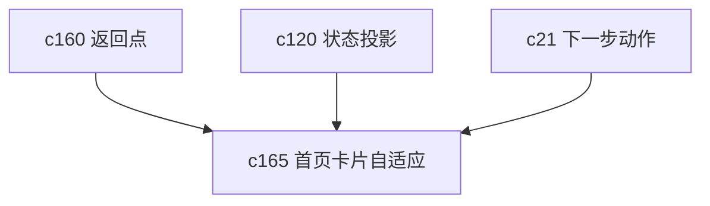

## Why

首页卡片一开始少的时候都好看，内容一多就会变成一面墙。真正的问题不是信息不够，而是优先级没被收口。用户回到首页时，最需要的是先看到最该处理的几件事。

## What Changes

- 定义 adaptive home cards，根据当前工作态自动调整卡片层级和信息密度。
- 增加 priority collapse，让低优先级卡片自动折叠，关键阻塞和待续工作优先露出。
- 区分探索态、整理态、交付态和维护态的首页呈现，不再一套卡片打天下。
- 让用户能手动固定少数关键卡片，避免算法把真正重要的事藏起来。

## Capabilities

### New Capabilities
- `adaptive-home-cards-and-priority-collapse`: 定义首页卡片自适应排序、折叠和固定语义。

### Modified Capabilities
- `workspace-home-and-operating-cockpit`: 需要支持卡片分层、折叠和动态排序。
- `workspace-state-projection-and-summary-cache`: 需要给首页提供稳定的优先级输入信号。
- `proactive-recommendations-and-next-best-actions`: 推荐动作需要能成为卡片优先级的正式因素。

## Impact

- Backend：会影响首页摘要聚合和优先级计算。
- Frontend：会影响首页布局、卡片折叠和固定交互。
- Dependencies：这条线紧跟 `c160`，一个管返回现场，一个管回到现场后先看什么。

