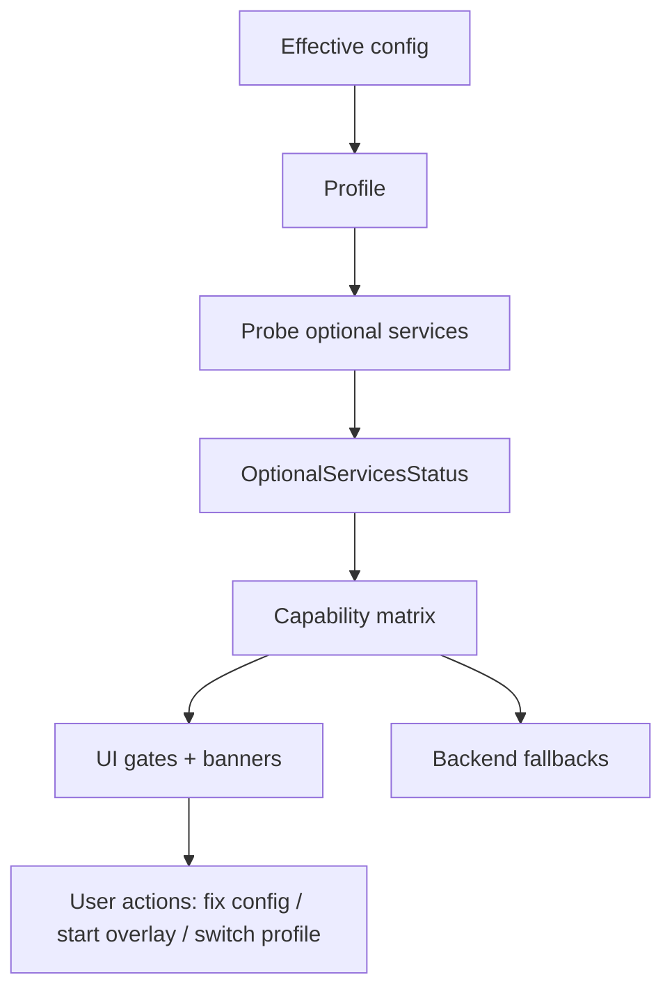

## Why

Chroma、Redis、Ollama 这些“可选服务”已经进入主路径：它们让体验更好、更快，但一旦不可用，系统现在更像在“赌运气”——有时自动降级，有时报错，有时前端只看到一个模糊的失败。

用户不需要知道所有实现细节，但必须知道两件事：当前还能用什么、以及怎么恢复到完整能力。这份 change 的目标就是把“降级模式”变成显式契约，而不是隐式行为。

## What Changes

- 定义 Optional Services 的标准状态输出与错误码（与现有监控/探活逻辑对齐）：
  - `service_key`、`status`、`endpoint`、`reason`、`recovery_hint`
  - 与 `ErrorResponse` 对齐：任何因为可选服务导致的失败都要带同一套 `code` + `correlation_id`
- 定义 profile 的能力矩阵（capability matrix）：
  - 每个 profile 在“服务缺失/不可用”时允许关闭哪些能力，哪些能力必须 hard fail（可配置 strict mode）。
- 明确降级规则（可读、可测试）：
  - Chroma 不可用：是否切换到 SQLiteVectorStore / InMemoryVectorStore，以及提示用户“当前是简化检索”。
  - Redis 不可用：禁用 embedding cache 或切换到本地 cache，并提示可能的性能影响。
  - Ollama 不可用：隐藏/禁用相关模型候选，并提示如何配置 endpoint。
- 前端体验收口：统一用一个 banner/面板展示“当前处于降级模式”的解释与下一步动作（与 `c34` 的错误恢复一致）。

## Capabilities

### New Capabilities

- `degraded-mode-contract`: 可选服务状态、能力矩阵、降级规则与用户提示的统一契约。

### Modified Capabilities

- `service-composition-profiles`: profile 与可选服务之间的依赖表达方式。
- `workspace-api-contract`: optional services 状态接口、错误码与 correlation_id 的返回要求。
- `workspace-ui-core`: 降级提示与恢复动作的 UI 要求（可见、可理解、可关闭但可回看）。
- `retrieval-and-cache`: 在降级状态下的检索/缓存行为约束（例如必须标注 fallback）。

## Impact

- Backend：探活/监控逻辑会更统一；出错时信息更完整、更少“靠猜”。
- Frontend：终于可以不用散落在各处判断“某个服务是不是挂了”；统一从能力矩阵驱动 UI。
- Dependencies：建议先把 `c14` 的 profile/有效配置定下来，再把降级规则落到每个 profile 上。

## Dependency Sketch

