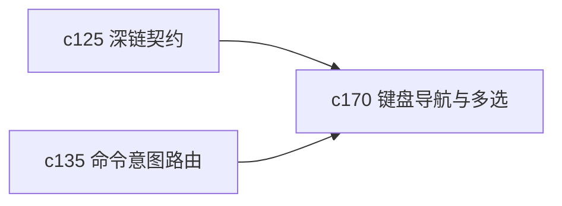

## Why

复杂工作台一旦不能靠键盘流畅穿梭，效率很快就会掉下来。现在局部快捷键已经有了，但跨面板移动、对象多选和批量动作还没有形成一条完整的键盘路径。

## What Changes

- 定义 keyboard-first panel navigation，让用户可以在主要面板之间稳定移动、聚焦和回退。
- 支持对象多选和范围选择，用键盘完成批量处理的高频动作。
- 统一多选状态和焦点状态，避免鼠标路径和键盘路径各走一套状态机。
- 让多选结果能直接接到命令面板和批量动作，而不是只能停在视觉选中。

## Capabilities

### New Capabilities
- `keyboard-first-panel-navigation-and-multi-select`: 定义键盘优先导航、多选和范围操作语义。

### Modified Capabilities
- `workspace-command-palette-and-shortcuts`: 需要承接多选对象和批量动作。
- `cross-panel-selection-and-deep-link-contract`: 需要扩展到键盘导航与多选状态。
- `workspace-ui-core`: 需要补焦点环、键盘路径和批量状态提示。

## Impact

- Frontend：会影响快捷键体系、焦点管理和多选交互。
- Backend/API：主要影响批量动作入口的参数约定。
- Dependencies：这条线站在 `c125` 和 `c135` 上面，是交互层的继续收口。

