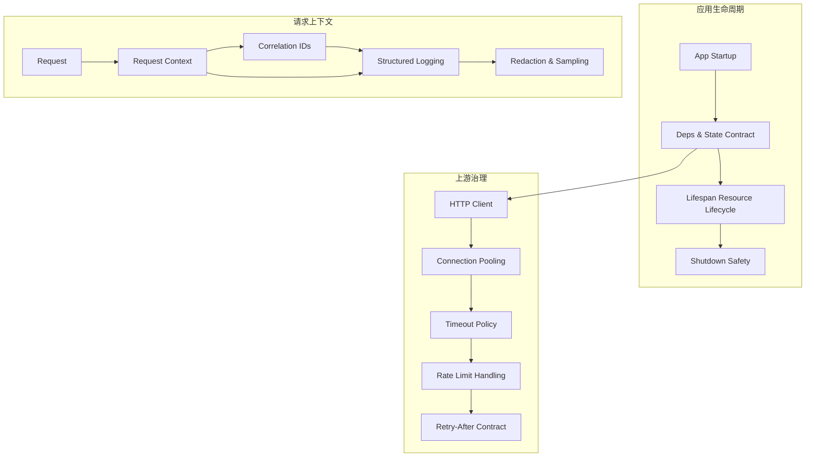

## Why

`c2210` 在定义 `AppState` / deps contract，`c2163` 在定义 lifespan 与 upstream HTTP 调用层，`c2152` 在定义 request context / correlation id，`c2166` 在定义 structured logging / redaction / sampling，`c2170` 在定义 rate limit / retry_after contract。它们都在处理同一个系统面：**后端一次请求和一次后台执行，如何在运行时被正确装配、传播、观测、退避和关闭**。

如果继续拆开推进，会产生三个问题：

- deps、lifespan、http client、日志、错误和限流会由不同 change 分别定义，运行时语义容易出现断层。
- correlation id 与日志字段如果不和 deps / upstream / shutdown 一起收口，就仍然只能覆盖部分链路。
- 限流与上游失败会继续像“偶发错误”一样散落在不同层，而不是成为同一套 runtime contract 的一部分。

## Merge Notes

- 合并自 `backend-deps-and-app-state-contract`
- 合并自 `app-lifespan-resource-lifecycle-and-shutdown-safety`
- 合并自 `request-context-and-correlation-ids`
- 合并自 `structured-logging-schema-redaction-and-error-sampling`
- 合并自 `upstream-rate-limit-handling-and-retry-after-contract`

## What Changes

- 定义 backend runtime contract：
  - `AppState` / deps 的最小存在性、类型边界、创建/关闭责任
  - optional services、worker、monitor、queue、http client registry 的统一装配语义
- 定义 request context propagation：
  - `correlation_id` 贯穿 HTTP、SSE、task、worker、upstream calls
  - response、events、logs 与 diagnostics 使用同一共同键
- 定义 lifecycle and shutdown order：
  - startup / draining / stopping background work / closing resources 的固定阶段
  - worker/monitor/SSE 停止顺序先于 DB/cache/vector/http clients close
- 定义 upstream governance：
  - shared HTTP client registry、timeout / retry / pool policy、service_key 维度
  - rate limit、retry_after、backoff、local budget pressure 使用统一 contract
- 定义 observability and safety：
  - structured logging schema、redaction、error sampling、fingerprint
  - shutdown observability 与 upstream failure mapping 对齐统一错误语义

## Capabilities

### New Capabilities

- `backend-deps-and-app-state-contract`
- `app-lifespan-resource-lifecycle-and-shutdown-safety`
- `http-client-pooling-and-upstream-timeout-policy`
- `request-context-and-correlation-ids`
- `structured-logging-schema-redaction-and-error-sampling`
- `upstream-rate-limit-handling-and-retry-after-contract`

### Modified Capabilities

- `optional-services-readiness-contract`
- `task-runtime-durability-and-restart-reconciliation`
- `sse-event-schema-and-stream-client`
- `openapi-error-contract-and-doc-gates`
- `dev-diagnostics-workbench-and-state-dumps`

## Impact

- Backend：运行时装配、dependency injection、http 调用、日志、限流和 shutdown 会收口到一套 contract。
- Frontend：会间接受益于更稳定的 `correlation_id`、`retry_after` 和解释性错误事件。
- Operations：同一次动作可以更稳定地从 request → task → upstream → logs 串起来。
- Migration：默认直接统一到新 runtime contract，不保留散装 deps / logging / retry 旧写法。

## Dependency Sketch

